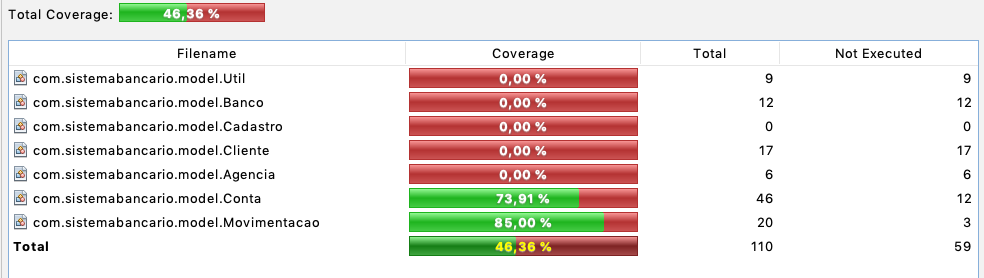

# Projeto Java de Sistema Bancário para testes com JUnit 5

Atividade solicitada pelo professor: Manoel Campos (https://github.com/manoelcampos) para a disciplina de Testes de Software.

## Cobertura de Código usando o Jacoco:

